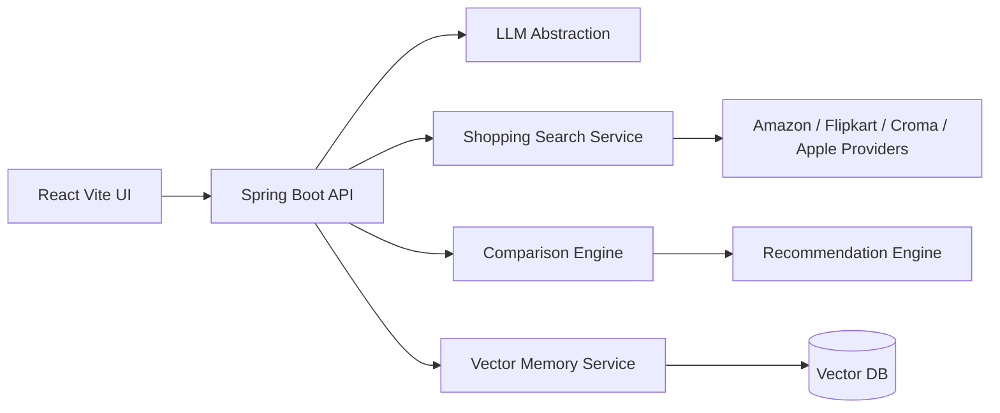

# Architecture

## Current POC

- Frontend: React, TypeScript, Vite, Three.js, Framer Motion, Lucide icons.
- Backend: Spring Boot 3 WebFlux API skeleton with provider and recommendation abstractions.
- Data: deterministic sample product catalog for repeatable demos.
- AI layer: interface-ready extraction and recommendation services; external LLM keys can be added without changing the UI contract.

## Next Production Steps

- Replace `MockSearchProvider` with platform adapters.
- Add Spring AI provider implementations for OpenAI, Azure OpenAI, or Ollama.
- Persist conversation turns and embeddings in a vector database such as Qdrant or ChromaDB.
- Add JWT/OAuth2 security, rate limits, observability, and CI checks.
