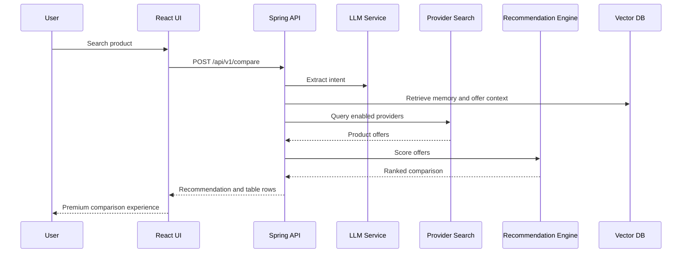

# Search Sequence

```mermaid
sequenceDiagram
  participant User
  participant UI as React UI
  participant API as Spring API
  participant LLM as LLM Service
  participant Search as Provider Search
  participant Rank as Recommendation Engine
  participant Vector as Vector DB

  User->>UI: Search product
  UI->>API: POST /api/v1/compare
  API->>LLM: Extract intent
  API->>Vector: Retrieve memory and offer context
  API->>Search: Query enabled providers
  Search-->>API: Product offers
  API->>Rank: Score offers
  Rank-->>API: Ranked comparison
  API-->>UI: Recommendation and table rows
  UI-->>User: Premium comparison experience
```
